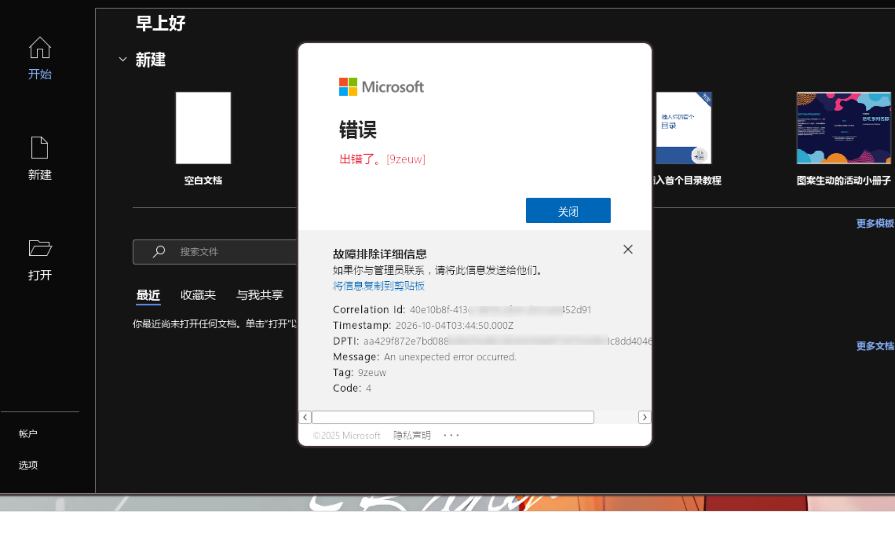
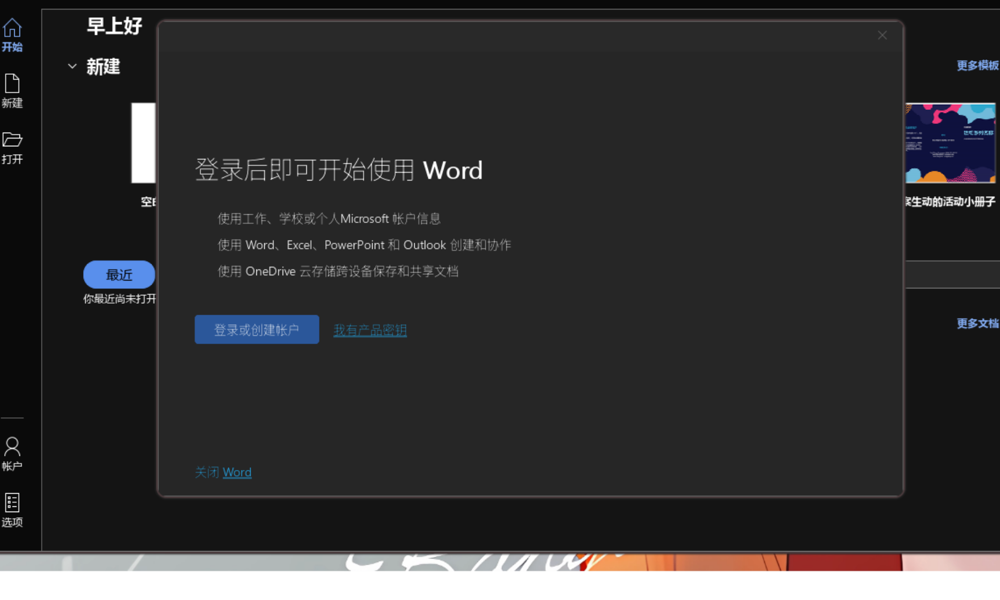
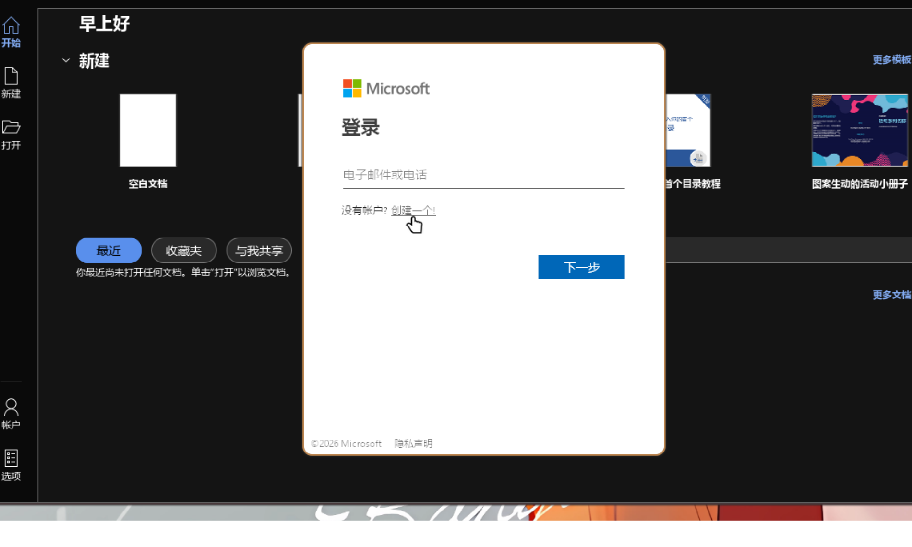
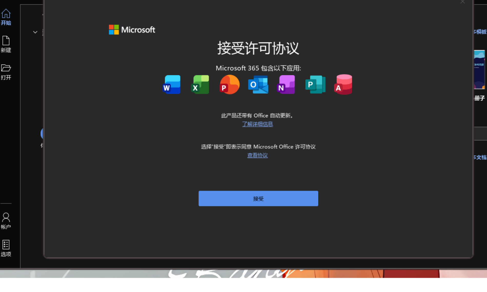
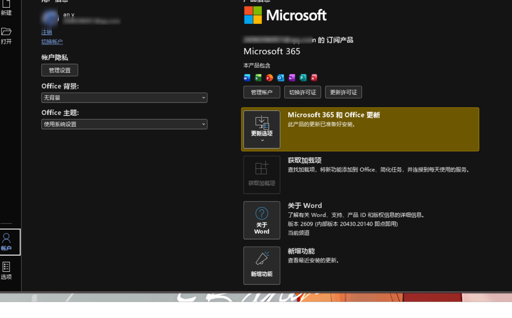

# office365-nixos

在 NixOS 上声明式部署 Microsoft 365 的 Wine 运行资源，并由用户显式管理 Office prefix 和中文字体。

- 语言支持：可用 `officectl init --language <语言 ID>` 选择英文 + 指定语言（默认 `zh-cn`，例如 `zh-tw`、`ja-jp`）；界面语言可在 Office「文件 → 选项 → 语言」中自行切换。除默认的中英文组合外，其他语言尚未经过测试。
- 激活要求：需使用用户自己的正版 Microsoft 365 授权登录激活。
- 支持平台：`x86_64-linux`
- 图形后端：X11 / XWayland
- Office 运行时：Wine4Office `0.2.2-beta.2`
- 下载服务修补：从同版本源码重建 `qmgr.dll`，修复分段下载失败时异步读取缓冲区提前释放导致的服务崩溃（上游 issue [#113](https://github.com/ttv20/wine4office/issues/113)）；详见[下载故障调查与验证](docs/DOWNLOADS.md)。
- NixOS 模块：`programs.office365`

## 已知问题

1. **原生 Wayland 渲染路径无法正常使用**：会导致光标停留在窗口缩放（resize）状态。当前启动器使用 X11 / XWayland 路径。
2. **OneNote 无法正常打开**：启动时查询 WMI 类 `Win32_ServerFeature`，当前 runner 未实现该类，导致弹出“必须先安装桌面体验（Desktop Experience）”并阻止进入主界面。对应 [Wine bug #47135](https://bugs.winehq.org/show_bug.cgi?id=47135)，详见[隔离复现记录](docs/ONENOTE.md)。保留 `onenote365` 命令和桌面入口，但当前不可用。
3. **Word 多页文档滚动性能异常**：多页面下滚动可能明显卡顿。上游 [PR #57：稀疏 Present1 更新](https://github.com/ttv20/wine4office/pull/57) 记录了相关渲染瓶颈：原路径在每次 `Present1` 时复制整个表面，而非仅处理变更及滚动区域，增加局部重绘开销。上游已为符合条件的 WineD3D Vulkan 交换链实现稀疏更新，但 OpenGL 等路径仍保留全量复制。本项目当前使用 WineD3D OpenGL（`renderer=gl`），不在该优化的适用范围内；目前没有在本项目中验证通过的滚动修复方案。

4. **Word 关闭时可能无法正常退出**：在当前 X11 / XWayland 路径下，关闭含有未保存修改的文档时，弹出的保存确认对话框可能难以定位或操作，导致 Word 一直等待确认、无法正常结束。遇到这种情况可手动 `kill` 对应的 `WINWORD.EXE` 进程；未保存的修改可能丢失。

5. **应用启动阶段偶发无响应（界面卡死）**：目前只在应用启动阶段观察到：启动画面可能长时间停住，或刚打开时窗口无响应，且不易稳定复现；应用正常启动完成后，日常使用暂未再遇到。隔离排查抓到的挂死点位于 Wine 把 Office 的 Direct2D 界面转换为 OpenGL 的渲染路径（GL 上下文创建）：`d2d_factory_CreateWicBitmapRenderTarget` → `d3d10` → `dxgi` → `wined3d` → `wglMakeContextCurrentARB`；伴随日志 `MESA-EGL: warning: egl: failed to create dri2 screen`，随后应用全部线程停在 futex / 管道等待，界面冻结。这是上游 Wine / Wine4Office 渲染路径的问题（上游 issue [#114](https://github.com/ttv20/wine4office/issues/114)），目前没有验证通过的修复：软件渲染（llvmpipe）会让 Office 界面渲染不出来，NVIDIA EGL/GLX 环境变量方案尚未完成复测。另外，被强杀的应用会留下“上次启动失败”标记，下次启动可能停在启动画面，等待一个在 Wine 下不渲染的安全模式对话框；可删除注册表 `HKCU\Software\Microsoft\Office\16.0\Word\Resiliency` 后重试。遇到启动无响应时建议先等待片刻，避免频繁强杀。

## 接入 NixOS

本项目提供标准 NixOS module 输出 `nixosModules.default`。按 NixOS 的 Flake 配置方式，在系统 flake 中添加输入，并将模块放入 `nixosSystem.modules`。

### 1. 添加 flake input

保留现有 `nixpkgs` 输入及其分支，在系统 `flake.nix` 的 `inputs` 中添加：

```nix
office365-nixos = {
  url = "github:yankedi/office365-nixos";
  inputs.nixpkgs.follows = "nixpkgs";
};
```

然后在现有 `outputs` 中，将项目模块加入对应主机的 `nixosSystem.modules`，保留原有模块。例如：

```nix
outputs = inputs@{ nixpkgs, ... }: {
  nixosConfigurations."my-host" = nixpkgs.lib.nixosSystem {
    system = "x86_64-linux";
    modules = [
      inputs.office365-nixos.nixosModules.default
      ./configuration.nix
      # 保留其他已有模块
    ];
  };
};
```

将 `my-host` 替换为你在 `nixosConfigurations` 中使用的名称。`nixpkgs.follows` 让 Office flake 与系统共享同一份 nixpkgs 依赖；`flake.lock` 会固定实际使用的提交。

### 2. 启用模块

在 `configuration.nix` 中配置：

```nix
{ lib, ... }:
{
  programs.office365.enable = true;

  # ODT 是非自由软件，只允许此安装工具。
  nixpkgs.config.allowUnfreePredicate = pkg:
    lib.getName pkg == "office-deployment-tool";
}
```

如果已有 `nixpkgs.config.allowUnfreePredicate`，请把 `office-deployment-tool` 条件并入现有函数，保留其他已允许的包。若现有逻辑是按包名白名单，可将包名加进同一列表；若现有函数包含其他判断，用 `||` 组合条件。不要为了 ODT 全局开启 `allowUnfree = true`。

**重要：**必须在同一次 NixOS module evaluation 中导入 `nixosModules.default`，否则 `programs.office365` 选项未声明，会报 `The option programs.office365 does not exist`。

### 使用 flake-parts 的配置

若通过 `flake.modules.nixos.<name>` 定义本地系统模块，要在这个 NixOS module 自身的 `imports` 中导入项目模块。外层 flake-parts 参数中的 `inputs` 可由闭包引用：

```nix
{ inputs, ... }:
{
  flake.modules.nixos.office365 = { lib, ... }: {
    imports = [ inputs.office365-nixos.nixosModules.default ];

    programs.office365.enable = true;
    nixpkgs.config.allowUnfreePredicate = pkg:
      lib.getName pkg == "office-deployment-tool";
  };
}
```

这和 NixOS 手册的模块规则一致：`imports` 负责将声明选项的模块加入当前 module set；只写 `programs.office365.enable = true` 不会自动引入选项定义。
基本示例中的 `configuration.nix` 不直接引用 flake `inputs`，所以不需 `specialArgs`；只有 NixOS module 本身要访问 `inputs` 时，才通过 `nixosSystem.specialArgs` 显式传入。

### 构建和切换

```bash
# 构建系统闭包，不创建当前目录下的 result 链接
nix build .#nixosConfigurations.my-host.config.system.build.toplevel --no-link

# 应用系统配置
sudo nixos-rebuild switch --flake .#my-host
```

若要更新到此项目的新提交，在系统 flake 目录运行 `nix flake update office365-nixos`，审阅并保留更新后的 `flake.lock`，再构建/切换。若 flake 使用其他 NixOS 配置名称，请相应替换 `my-host`。

`nixos-rebuild switch` 只准备 runner、运行库、ODT、locale、阴影助手、命令、图标和桌面入口。**构建与切换不会运行 Wine、创建用户 prefix、安装 Office、下载字体 ISO 或构建中文字体包。**桌面入口会立即出现；Office 尚未安装时，启动器会提示运行 `officectl init`。

模块选项：

| 选项 | 默认值 | 说明 |
|---|---:|---|
| `programs.office365.enable` | `false` | 启用资源包和桌面入口 |
| `programs.office365.defaultApplications` | `true` | 将 Office 专用文档 MIME 类型设为系统默认应用 |
| `programs.office365.package` | 项目包 | 允许覆盖默认运行资源包 |

参考：[NixOS Manual: 写 NixOS Modules](https://nixos.org/manual/nixos/stable/#sec-writing-modules)、[NixOS Manual](https://nixos.org/manual/nixos/stable/)、[nix.dev: Flakes](https://nix.dev/concepts/flakes)、[nix.dev: Module system deep dive](https://nix.dev/tutorials/module-system/deep-dive)、[Nixpkgs Reference Manual: Unfree packages](https://nixos.org/manual/nixpkgs/stable/)、[flake-parts: modules](https://flake.parts/options/flake-parts-modules)。

## 安装 Office

在普通用户的图形会话中运行：

```bash
officectl init
```

安装英文 + 指定语言（默认 `zh-cn`）：

```bash
officectl init --language zh-tw
```

`--language` 接受 ODT 语言 ID，不区分大小写，`_` 会转换为 `-`（如 `zh_tw`、`zh-TW` 都会规范为 `zh-tw`）。
可用的常见取值包括 `zh-tw`、`ja-jp`、`ko-kr`、`de-de`、`fr-fr`、`es-es` 等；除默认的 `zh-cn + en-us` 组合外，其他语言尚未经过测试，如遇到问题请附上安装日志。

默认 prefix 固定按用户环境展开：

```bash
WINEPREFIX="${XDG_DATA_HOME:-$HOME/.local/share}/wineprefixes/office365"
```

安装 64 位 `O365BusinessRetail`、Current 通道、英文和所选语言（默认 `zh-cn + en-us`）。
Office 主体由 ODT 在此时联网下载。初始化需要正常的 X11 / XWayland 图形会话和用户 D-Bus。

初始化严格限于安装所需步骤：`wineboot` → 重置并等待 wineserver → broker 保活 / 服务看护 →
ODT 安装 → 检查退出码、`WINWORD.EXE` 和对应语言目录 → 清理本次 prefix 的安装进程。
不安装字体、不启动 Word、不执行登录激活。
ODT 启动后，`officectl` 会监视 prefix 中的 `NIXOS-*.log`，把当前 Click-to-Run 任务、阶段完成事件和阶段进度写到终端，例如：

```text
Office 安装阶段：下载并展开 O365BusinessRetail 数据…
  当前阶段进度：下载并展开 O365BusinessRetail 数据 22%
Office 阶段结束：下载并展开 O365BusinessRetail 数据。
Office 安装阶段：应用 Office 程序和语言组件…
```

这里显示的是具体安装阶段的进度，不是单独的网络下载字节比例。详细原始日志仍保存在 prefix 的 `drive_c/windows/` 和 `drive_c/users/*/AppData/Local/Temp/`。
阶段百分比每次增长都会输出；同时显示原生日志中的下载文件名和已完成传输的字节数。连续 20 秒没有新的可显示事件时，会提示正在等待安装器报告新进度，并保留最近报告的阶段百分比。网络流量停止后，安装器仍可能在展开数据、集成应用或注册组件。
启动器保留宿主 Fontconfig 配置，使 NixOS / Home Manager 字体目录中的中日韩字体在 Windows 字体尚未装入 prefix 时也可回退显示。

现有成功安装可直接接管，重复 `init` 只核验；若显式传入的 `--language` 与现有安装语言不同，会拒绝并提示先 `officectl uninstall` 或 `officectl init --reset`。
非空但未通过验收的 prefix 会保留。
显式重建（会删除该 prefix，包括其中的账户和许可证数据）：

```bash
officectl init --reset
```

卸载 Office 并删除整个默认 prefix（包括账户、许可证、设置及 prefix 内安装的字体）：

```bash
officectl uninstall
```

这不会更改 NixOS 声明的 runner、桌面入口或运行库。

## 独立安装中文字体

```bash
officectl install chinese-fonts
```

只有这个命令会调用固定版本的字体 flake，按需从 Windows ISO 提取字体。
switch 的依赖闭包不包含这两个字体包、字体提取 VM 或 ISO。
字体资源来自 [`kugland/nix-ttf-ms-win11-auto`](https://github.com/kugland/nix-ttf-ms-win11-auto)，
锁定提交 `9e298e2aab68c1bfc22a039012b29595f04b4ac9`。

安装宋体、黑体、楷体、仿宋、等线和微软雅黑相关的 11 个字体文件，注册字体与 7 条中文名映射。
字体复制进 prefix；运行时不依赖源 ISO 或提取包。重复执行可更新 / 修复注册。
中文 locale 已由系统资源包提供。

## 首次登录与激活（图解）

安装完成后运行 `word365`，使用具有 Microsoft 365 授权的账户登录。以下步骤和截图迁自原 `office365-linux` 项目在 Wine4Office `0.2.2-beta.2` 下验证的流程；截图中的账户信息已打码。登录与激活由用户在 Office 界面中完成。

### 1. 首次启动并登录

```bash
word365
```

在首次出现的登录界面中完成账户登录。登录后可能出现「出错了。(9zeuw)」或 “Microsoft 365 sign-in could not be completed”。若遇到这个对话框，点击「关闭」，然后关闭 Word，继续下一步。



### 2. 重新打开 Word

再次运行 `word365`。会再次出现「登录后即可开始使用 Word」，点击「登录或创建帐户」。



### 3. 点击「创建一个」

在随后出现的界面中，点击「没有帐户？创建一个!」。这是在已完成首次登录后触发许可证激活的已验证操作，随后等待许可协议界面出现。



### 4. 接受许可协议

点击「接受」。接受协议后 Word 可能自动退出；此时重新运行 `word365` 即可。



### 5. 确认激活状态

重新打开 Word，进入「文件 → 帐户」，确认显示「Microsoft 365」订阅产品及「管理帐户 / 切换许可证 / 更新许可证」。下图是完成激活后的账户页。



## 启动应用和打开文件

| 命令 | 应用 |
|---|---|
| `word365` | Word |
| `excel365` | Excel |
| `powerpoint365` | PowerPoint |
| `outlook365` | Outlook |
| `access365` | Access |
| `publisher365` | Publisher |
| `onenote365` | OneNote：**当前已知无法正常打开**，仍保留启动入口 |

```bash
word365
word365 "中文目录/文档 1.docx" "另一份文档.docx"
excel365 "工作簿.xlsx"
powerpoint365 "演示文件.pptx"
```

各启动器统一管理 prefix、运行库、中文 locale，并将 Linux 路径转换成 Wine 的 `Z:` 路径。
启动时固定使用 X11 / XWayland，并设置 `UseEGL=N` 使用 GLX，避免此版 runner 的 EGL / Direct2D 上下文失败。
支持中文、空格、多个文件和本地 `file://` URI。
每个 prefix 最多运行一个阴影看护助手，持续隐藏 Office 的四条 `MSO_BORDEREFFECT` 阴影窗口；
Office 窗口全部关闭后助手自行退出。

桌面入口声明 Office 专用格式，模块默认设置这些格式的默认应用。
包含 Word / Excel / PowerPoint 的传统及 OOXML 格式、Access 数据库、Publisher 文档、Outlook `.msg/.oft` 和 OneNote 笔记。
不接管 TXT、PDF、CSV、通用邮件格式或 `mailto:`；用户已有的用户级 MIME 设置仍可覆盖系统默认。
Wine 自动生成菜单和文件关联的行为已禁用，由 NixOS 模块提供统一入口与关联。
如仅需要菜单入口，不设置默认关联：

```nix
programs.office365.defaultApplications = false;
```

## 状态与日志

- Office 和账户状态：上述用户 prefix。
- 安装 / 字体 / 启动日志：`${XDG_STATE_HOME:-$HOME/.local/state}/office365-nixos/logs/`。
- 操作锁：用户运行目录下的 `office365-nixos/`，无运行目录时使用用户缓存目录。
- 安装和字体操作使用独占锁；应用运行使用共享锁。修改 prefix 前关闭正在运行的应用。
- 运行环境与工具位于 Nix store，由系统配置持有，不依赖临时目录或旧项目。

安装排查须同时查看 prefix 内 `drive_c/windows/NIXOS-*.log` 和
`drive_c/users/*/AppData/Local/Temp/NIXOS-*.log`。
首次 `wineboot` 可能留下缺少 `ProgramFiles` / `TEMP` 的缓存服务环境，导致 `30029-25`；
控制器会在任何 helper / 服务查询前重启该 prefix 的 wineserver。

## 构建与检查

```bash
nix build
nix flake check
nix run . -- --help
python3 -m unittest discover -s tests -v
```

构建不会执行 Office 安装。冷安装、字体安装属于显式的运行时集成检查。
项目只保留新架构所需代码，不包含旧 prefix 模板、WineCX 变体或实验安装流程。

## 许可和来源

项目代码遵循 GPL-3.0-or-later，见 `LICENSE`。
阴影助手由此前 `yankedi/office365-linux` 项目的助手迁入，使用 Microsoft KB 2821007 的窗口消息。
Wine4Office、ODT、Microsoft 365 和 Windows 字体各自遵循上游许可；代码许可不改变这些资源的许可。

## 免责声明

本项目是社区项目，与 Microsoft、WineHQ、CodeWeavers 及 Wine4Office 项目均无隶属、赞助或背书关系。
Microsoft、Microsoft 365、Office、Windows、Word、Excel、PowerPoint、OneNote 等名称是 Microsoft Corporation 的商标或注册商标；其他名称与商标归各自所有者。
本项目不包含或分发 Microsoft Office 的安装文件与授权。Office 由微软官方部署工具从微软服务器下载并安装到用户自己的 prefix；用户需自行拥有有效的 Microsoft 365 / Office 授权，并遵守微软的许可条款和当地法律。本项目不提供绕过激活或许可验证的机制。
中文字体由第三方项目 [`kugland/nix-ttf-ms-win11-auto`](https://github.com/kugland/nix-ttf-ms-win11-auto) 按需从 Windows ISO 提取，本项目不附带或再分发字体文件；字体使用需自行确认相应授权。
本项目按“原样”提供，不附带任何明示或暗示的担保。安装、登录、激活或使用可能因上游 Wine 或 Microsoft 更新而失效；因使用本项目产生的数据丢失、许可问题或其他损失由用户自行承担。
