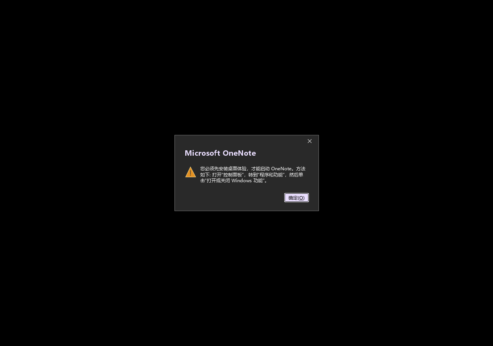

# OneNote 启动阻塞调查

## 结论

OneNote 在启动阶段检查 Desktop Experience。Wine4Office `0.2.2-beta.2` 未实现它所查询的 WMI 类 `Win32_ServerFeature`，导致 OneNote 显示以下提示，无法进入主界面：

> 您必须先安装桌面体验，才能启动 OneNote。



这是 [Wine bug #47135](https://bugs.winehq.org/show_bug.cgi?id=47135) 中记录的兼容性问题；[WineHQ 论坛的相关讨论](https://forum.winehq.org/viewtopic.php?t=35365) 也指向该报告及其 WMI 补丁。

## 本次复现证据

2026-10-04 使用未登录的 Office 安装备份临时副本，在独立 Xvfb 显示中测试：

- Wine4Office：`0.2.2-beta.2`，与项目固定 runner 一致。
- Office：64 位 `O365BusinessRetail`，`16.0.20430.20140`，`zh-cn + en-us`。
- 应用环境：项目启动器的 X11、WineD3D OpenGL 和宿主 Fontconfig 配置。
- 调试通道：`wbemprox`、`module`、`loaddll`。

OneNote 主线程的 WMI 跟踪记录了：

```text
wbem_locator_ConnectServer ... L"ROOT\\CIMV2" ...
wbem_services_ExecQuery ... L"WQL", L"SELECT Name FROM Win32_ServerFeature" ...
enum_class_object_Next ...
```

随后出现上图的 Desktop Experience 对话框。当前 runner 对应版本的 [`dlls/wbemprox/builtin.c`](https://github.com/ttv20/wine4office/blob/0.2.2-beta.2/dlls/wbemprox/builtin.c) 中没有 `Win32_ServerFeature` 类的定义或注册。独立执行 `wmic path Win32_ServerFeature get ID,Name` 也未能获取该类，退出码为 `255`。

测试仅运行在临时副本中，结束后关闭该副本的 wineserver 和 Xvfb；未修改默认用户 prefix，也未执行登录或激活。

复现准备时还发现备份丢失了部分 `user.WINEREPARSE` 扩展属性，最初导致 `AppVIsvSubsystems64.dll` 加载失败。仅在临时副本补齐这些重解析点元数据后，才获得上述 OneNote WMI 查询及对话框证据；该复制问题与 Desktop Experience 启动检查是两个独立问题。

## 修复方向与当前状态

修复应位于 runner 的 WMI 提供层：在 `wbemprox` 中实现 `Win32_ServerFeature` 及 OneNote 检查所需的 Desktop Experience 查询结果，并核验枚举和属性行为。

当前项目打包的是上游预编译 runner，尚未加入或验证这一修补。因此继续保留 OneNote“当前不可用”的标注。解除这项启动检查后，仍需单独验证主界面、笔记创建/保存及同步功能，不能仅凭消除提示就判定 OneNote 完全可用。
